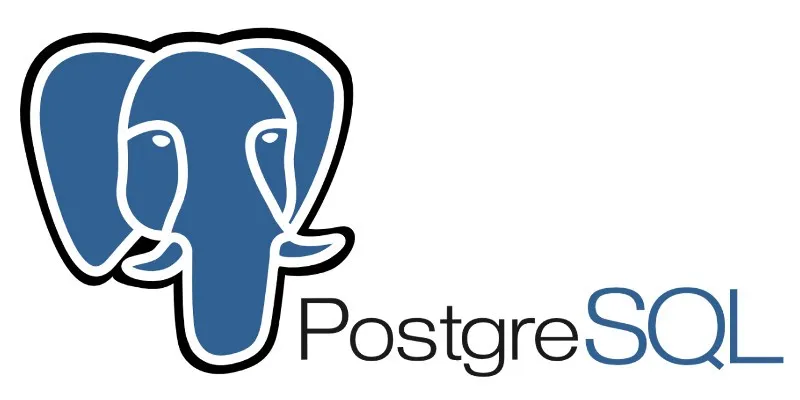

# Fullstack_Tutorials
Creating a Fullstack App using React, Django and AWS as my TechStack

## Summary of each topic
### Chapter 1: Creating a Django Project

Responsibilities of backend developers
The backend is typically made of three major parts:
• Server: A machine or an application (NGINX) that receives requests
• Application: A running application on the server that receives the requests, validates these requests, and sends an appropriate response
• Database: Used to store data
The responsibilities of backend programmers could easily involve writing APIs, writing code to interact with a database, creating modules or libraries, also working on business data and architecture, and much more.
They also have to do the following:
• Coordinate and communicate with frontend developers to transfer data efficiently to the client side of the application
• Collaborate with quality assurance engineers to optimize the server-side processes and also pass some security checks
• Optimize the application when the number of requests or users scales as well
• Analyze the requirements of the project and create a simple structure to handle bugs and errors
• Propose efficient solutions for cloud hosting but also build CI/CD pipelines
The backend architecture actually helps build one of the most common interfaces for consuming data in the software industry: an Application Programming Interface (API).

### Chapter 2:Authentification and Authorization using JWTs

Chapter 3:Social Media Post Management

Chapter 4:Adding Comments to Social Media Posts

Chapter 5:Testing the REST Api

Chapter 5:
Chapter 5:
Chapter 5:
Chapter 5:
Chapter 5:
Chapter 5:

#creating a virtual environment
pip install --user virtualenv
#starting the virtual environment
python -m venv venv
